# VoidMuse

🚀 **开源驱动的智能AI IDE插件** | **学习型AI工程化项目**

适配 IntelliJ IDEA & Visual Studio Code

---

## 🎯 项目愿景

> **不仅仅是一个AI插件，更是一个AI工程化学习平台**

VoidMuse致力于通过**开源组件整合**的方式，以**最低的开发成本**构建高效智能的AI IDE插件。我们相信开源的力量，通过精心选择和整合优秀的开源组件，让每个开发者都能轻松构建自己的AI工具。

### 🌟 核心理念

- 📚 **学习导向**: 提供完整的技术原理文档，让用户深度理解AI工程化
- 🔧 **开源整合**: 基于20+优秀开源组件，降低开发门槛
- 🧠 **知识传递**: 从Embedding到向量数据库，全面覆盖前沿AI概念
- 💡 **实践驱动**: 理论与实践结合，边学边用

---

## 🚀 快速开始

### 使用方式
直接使用插件

**VS Code安装**
1. 打开VS Code扩展商店 (Ctrl+Shift+X)
2. 搜索 "VoidMuse"
3. 点击安装并重启编辑器

**IntelliJ IDEA安装**
1. 打开 Settings → Plugins
2. 搜索 "VoidMuse"
3. 点击安装并重启IDE

作为学习者 - 本地开发启动详见 [开发指南](doc/DEVELOPMENT_GUIDE.md)

### 🎯 三分钟快速上手

想要立即体验VoidMuse的强大功能？跟着我们的快速配置指南，三步搞定！

👉 **[📖 查看三步快速上手指南](doc/quick-start.md)**

> 💡 只需配置AI模型API密钥，就能开始使用基础功能。搜索和代码理解功能可以后续按需配置。

### 详细配置指南

如果你需要更详细的配置说明，可以查看以下文档：

- 🤖 **[AI模型配置](doc/freeLLMQuota.md)** - 获取免费API密钥和配置指南
- 🔍 **[搜索功能配置](doc/googleSearchConfig.md)** - Google搜索配置详细教程
- 🔍 **[博查搜索配置](doc/bochaSearchConfig.md)** - 国内搜索服务配置
- 🧠 **代码理解配置** - 使用相同的AI模型API即可

---

## 🏗️ 整体架构

*VoidMuse采用模块化架构设计，支持多IDE平台，集成多种AI模型，提供完整的AI开发体验。*

详细架构文档：[技术架构说明](doc/architecture.md)

---

## 🔬 技术亮点与学习价值

### 🧠 AI工程化核心概念

- **Embedding技术**: 从原理到实践的完整解析
- **向量数据库**: 本地化索引与检索机制
- **上下文管理**: 大模型对话的上下文优化策略
- **MCP协议**: 多模态对话协议的标准化实现

### 🔧 开源组件生态

我们精心选择并整合了以下优秀开源组件：

- **Ant Design 5.x** - 企业级UI设计语言
- **TipTap** - 富文本编辑器
- **Vercel的 ai-sdk** - 多模型支持、agent框架

### 📖 学习资源汇总

1. 微软 AI Agents for Beginners：构建AI代理的基础知识，https://learn.microsoft.com/zh-cn/shows/ai-agents-for-beginners/
2. 吴恩达 Agentic AI 课程：代理式AI的实际应用，https://deeplearning.ai
3. Hugging Face AI Agents 课程：实用的AI智能体开发技能，https://huggingface.co/learn/agents-course/zh-CN/unit0/introduction
4. Google 5天 AI Agent 培训课：实战项目经验，https://rsvp.withgoogle.com/events/google-ai-agents-intensive_2025/home
5. Anthropic 官方课程：高级AI Agent技术，https://anthropic.skilljar.com
6. Coursera AI Agents 专项课程：学术理论与实际应用结合，https://coursera.org/specializations/ai-agents
7. Salesforce AI Agent Course：企业级AI Agent解决方案，https://salesforce.com/ap/agentforce/ai-agent-course/

---

## 🛠️ 功能特性

### 🧠 智能代码补全 (AutoComplete)

- **技术原理**: 基于上下文感知的智能补全算法
- **学习价值**: 了解AI代码补全的实现机制
- **核心特性**: 
  - 实时代码分析
  - 上下文感知补全
  - 多语言支持

### 🔍 本地代码库索引 (Codebase)

- **技术原理**: 向量化存储 + 语义检索
- **学习价值**: 掌握向量数据库的构建与优化
- **核心特性**:
  - 本地化向量数据库
  - 语义相似度检索
  - 智能代码上下文提取

### 💬 多模型AI对话 (AI Chat)

- **技术原理**: 多轮对话 + 工具调用 + 上下文管理
- **学习价值**: 理解大模型应用的工程化实践
- **支持模型**:
  - OpenAI GPT系列
  - Anthropic Claude系列
  - DeepSeek系列
  - 通过OpenRouter支持更多模型

### 🔗 MCP协议支持

- **技术原理**: 标准化多模态对话协议
- **学习价值**: 跨平台AI交互的设计模式
- **协议特性**:
  - 工具调用标准化
  - 多模态数据处理
  - 可扩展的插件架构

### 🔍 智能搜索集成

- **支持引擎**: Google搜索、博查AI搜索
- **配置文档**: 
  - [Google搜索配置](doc/googleSearchConfig.md)
  - [博查搜索配置](doc/bochaSearchConfig.md)
- **免费资源**: [大模型厂商免费额度汇总](doc/freeLLMQuota.md)

---

## 📚 学习路径指南

### 🎯 适合人群

- AI工程师想了解IDE插件开发
- 前端/后端开发者想学习AI集成
- 学生和研究者想理解AI工程化
- 开源爱好者想参与AI项目

### 📖 推荐学习路径

#### 初级路径 (AI概念入门)
1. [什么是Embedding？](doc/tutorial/embedding-basics.md)
2. 向量数据库基础

#### 高级路径 (工程实践)
1. [Codebase索引原理与实现](doc/tutorial/codebase-implementation.md)
2. 提高检索准确率的策略
3. 多模型适配架构设计
4. MCP协议深度解析

### 🛠️ 实践项目

- [实现深度搜索](doc/tutorial/function%20call的实践-实现深度搜索.md)
- Embedding模型踩坑合集
- 自定义Embedding模型集成
- 扩展MCP协议支持
- 实现自定义搜索引擎

---

## 🚀 未来功能规划

| 功能模块 | 核心特性 | 技术原理 | 学习价值 |
|---------|---------|---------|----------|
| 🧠 **上下文记忆** | 跨会话记忆、智能优先级、个性化学习 | 向量数据库 + 语义检索 |AI记忆系统设计 |
| 🗜️ **上下文压缩** | 动态长度管理、多级压缩、语义保持 | 智能摘要 + 分层压缩 |大模型上下文优化 |
| 🤖 **Agent代码生成** | 需求分析、架构设计、自动实现、测试验证 | 多Agent协作框架 | AI驱动软件开发 |

---

## 📊 数据收集说明

### 🔒 隐私保护承诺

为了更好地了解用户使用情况并改进产品体验，VoidMuse在GUI界面中集成了**极简化的埋点功能**。我们承诺：

- ✅ **仅收集页面访问数据**：只记录页面进入和离开时间，用于计算页面停留时长
- ✅ **无敏感信息收集**：不收集任何代码内容、个人信息或操作细节
- ✅ **透明开源**：所有埋点代码完全开源，可在 `gui/src/services/AnalyticsService.ts` 中查看

### 📚 埋点技术学习价值

我们的埋点实现也是一个很好的**前端数据分析学习案例**：

- 🎯 **多平台支持**：同时集成Google Analytics和百度统计
- ⏱️ **精确计时**：页面停留时间的准确计算方法
- 🔄 **生命周期管理**：页面可见性变化的完整处理
- 🛡️ **异常处理**：埋点失败时的优雅降级

---

## 🤝 贡献指南

我们欢迎各种形式的贡献！无论是Bug修复、功能开发、文档完善还是技术分享，都能让VoidMuse变得更好。

详细贡献指南：[贡献指南](doc/contributing.md)

### 社区贡献者

感谢所有为项目贡献代码、文档和想法的开发者们。你们的贡献让VoidMuse变得更好！

## 📞 联系我们

- 🐛 **问题反馈**: [GitHub Issues](https://github.com/voidmuse-dev/voidmuse/issues)
- 📧 **邮箱联系**: voidmuse@qq.com

### 💬 社群交流

| QQ交流群 | 微信交流群 |
|:---:|:---:|
|  |  |
| 扫码加入QQ群 | 扫码加入微信群 |
| 群号：865855850 | xxx |

> 💡 **提示**: 加群时请备注来源，方便管理员审核通过

---

**⭐ 如果这个项目对你有帮助，请给我们一个Star！**

**🚀 让我们一起构建更智能的开发体验！**

---

## 📄 许可证

本项目采用 [Apache-2.0](LICENSE) 许可证，我们相信开源的力量。