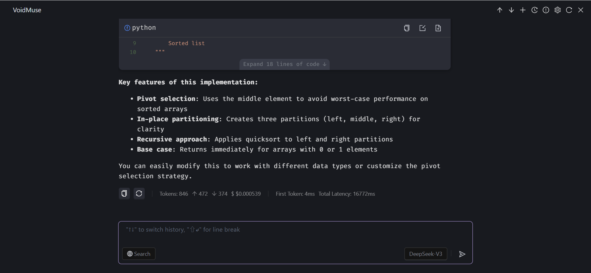

# VoidMuse

**Language / 语言**: [English](README.md) | [中文](README_ZH.md)

🚀 **Open Source Intelligent AI IDE Plugin** | **Learning-Oriented AI Engineering Project**

Compatible with IntelliJ IDEA & Visual Studio Code

---

## 🌐 Live Demo

- Online Web: https://voidmuse-dev.github.io/voidmuse/

  

---

## 🎯 Project Vision

> **More than just an AI plugin, it's an AI engineering learning platform**

VoidMuse is committed to building efficient and intelligent AI IDE plugins through **open source component integration** with **minimal development costs**. We believe in the power of open source, enabling every developer to easily build their own AI tools through carefully selected and integrated excellent open source components.

### 🌟 Core Philosophy

- 📚 **Learning-Oriented**: Provides comprehensive technical documentation to help users deeply understand AI engineering
- 🔧 **Open Source Integration**: Based on 20+ excellent open source components, lowering development barriers
- 🧠 **Knowledge Transfer**: Comprehensive coverage of cutting-edge AI concepts from Embedding to vector databases
- 💡 **Practice-Driven**: Combining theory with practice, learning while doing

---

## 🚀 Quick Start

### Usage Methods
Direct plugin installation

**VS Code Installation**
1. Open VS Code Extension Marketplace (Ctrl+Shift+X)
2. Search for "VoidMuse"
3. Click install and restart the editor

**IntelliJ IDEA Installation**
1. Open Settings → Plugins
2. Search for "VoidMuse"
3. Click install and restart IDE

For Learners - Local development startup details see [Development Guide](doc/en/DEVELOPMENT_GUIDE.md)

### 🎯 3-Minute Quick Setup

Want to experience VoidMuse's powerful features immediately? Follow our quick configuration guide and get started in three steps!

👉 **[📖 View 3-Step Quick Setup Guide](doc/en/quick-start.md)**

> 💡 Just configure the AI model API key to start using basic features. Search and code understanding features can be configured later as needed.

### Detailed Configuration Guide

If you need more detailed configuration instructions, check out the following documentation:

- 🤖 **[AI Model Configuration](doc/en/freeLLMQuota.md)** - Get free API keys and configuration guide
- 🔍 **[Search Function Configuration](doc/en/googleSearchConfig.md)** - Google Search configuration detailed tutorial
- 🔍 **[Bocha Search Configuration](doc/en/bochaSearchConfig.md)** - Domestic search service configuration
- 🧠 **Code Understanding Configuration** - Use the same AI model API

---

## 🏗️ Overall Architecture

*VoidMuse adopts a modular architecture design, supports multi-IDE platforms, integrates multiple AI models, and provides a complete AI development experience.*

Detailed architecture documentation: [Technical Architecture Description](doc/en/architecture.md)

---

## 🔬 Technical Highlights & Learning Value

### 🧠 AI Engineering Core Concepts

- **Embedding Technology**: Complete analysis from principles to practice
- **Vector Database**: Local indexing and retrieval mechanisms
- **Context Management**: Context optimization strategies for large model conversations
- **MCP Protocol**: Standardized implementation of multimodal conversation protocols

### 🔧 Open Source Component Ecosystem

We carefully select and integrate the following excellent open source components:

- **Ant Design 5.x** - Enterprise-class UI design language
- **TipTap** - Rich text editor
- **Vercel's ai-sdk** - Multi-model support, agent framework

### 📖 Learning Resources Summary

1. Microsoft AI Agents for Beginners: Basic knowledge for building AI agents, https://learn.microsoft.com/en-us/shows/ai-agents-for-beginners/
2. Andrew Ng's Agentic AI Course: Practical applications of agentic AI, https://deeplearning.ai
3. Hugging Face AI Agents Course: Practical AI agent development skills, https://huggingface.co/learn/agents-course/en/unit0/introduction
4. Google 5-Day AI Agent Training: Hands-on project experience, https://rsvp.withgoogle.com/events/google-ai-agents-intensive_2025/home
5. Anthropic Official Course: Advanced AI Agent technology, https://anthropic.skilljar.com
6. Coursera AI Agents Specialization: Combining academic theory with practical applications, https://coursera.org/specializations/ai-agents
7. Salesforce AI Agent Course: Enterprise-level AI Agent solutions, https://salesforce.com/ap/agentforce/ai-agent-course/

---

## 🛠️ Features

### 🧠 Intelligent Code Completion (AutoComplete)

- **Technical Principles**: Context-aware intelligent completion algorithms
- **Learning Value**: Understanding the implementation mechanisms of AI code completion
- **Core Features**: 
  - Real-time code analysis
  - Context-aware completion
  - Multi-language support

### 🔍 Local Codebase Indexing (Codebase)

- **Technical Principles**: Vectorized storage + semantic retrieval
- **Learning Value**: Master the construction and optimization of vector databases
- **Core Features**:
  - Local vector database
  - Semantic similarity retrieval
  - Intelligent code context extraction

### 💬 Multi-Model AI Chat (AI Chat)

- **Technical Principles**: Multi-turn dialogue + tool calling + context management
- **Learning Value**: Understanding engineering practices of large model applications
- **Supported Models**:
  - OpenAI GPT series
  - Anthropic Claude series
  - DeepSeek series
  - More models supported through OpenRouter

### 🔗 MCP Protocol Support

- **Technical Principles**: Standardized multimodal conversation protocol
- **Learning Value**: Design patterns for cross-platform AI interaction
- **Protocol Features**:
  - Standardized tool calling
  - Multimodal data processing
  - Extensible plugin architecture

### 🔍 Intelligent Search Integration

- **Supported Engines**: Google Search, Bocha AI Search
- **Configuration Documentation**: 
  - [Google Search Configuration](doc/en/googleSearchConfig.md)
  - [Bocha Search Configuration](doc/en/bochaSearchConfig.md)
- **Free Resources**: [Large Model Provider Free Quota Summary](doc/en/freeLLMQuota.md)

---

## 📚 Learning Path Guide

### 🎯 Target Audience

- AI engineers wanting to learn IDE plugin development
- Frontend/backend developers wanting to learn AI integration
- Students and researchers wanting to understand AI engineering
- Open source enthusiasts wanting to participate in AI projects

### 📖 Recommended Learning Path

#### Beginner Path (AI Concept Introduction)
1. [What is Embedding?](doc/en/tutorial/embedding-basics.md)
2. Vector Database Basics

### 🛠️ Practice Projects

- [Implementing Deep Search](doc/en/tutorial/function-call-deep-search.md)
- [Codebase Feature Technical Deep Analysis](doc/en/tutorial/codebase-technical-deep-dive.md)
- Custom Embedding Model Integration
- Extending MCP Protocol Support
- Implementing Custom Search Engines

---

## 🚀 Future Feature Roadmap

| Feature Module | Core Features | Technical Principles | Learning Value |
|---------|---------|---------|----------|
| 🧠 **Context Memory** | Cross-session memory, intelligent prioritization, personalized learning | Vector database + semantic retrieval | AI memory system design |
| 🗜️ **Context Compression** | Dynamic length management, multi-level compression, semantic preservation | Intelligent summarization + hierarchical compression | Large model context optimization |
| 🤖 **Agent Code Generation** | Requirement analysis, architecture design, automatic implementation, test validation | Multi-Agent collaboration framework | AI-driven software development |

---

## 📊 Data Collection Notice

### 🔒 Privacy Protection Commitment

To better understand user usage and improve product experience, VoidMuse integrates **minimalist tracking functionality** in the GUI interface. We promise:

- ✅ **Only collect page access data**: Only record page entry and exit times to calculate page dwell time
- ✅ **No sensitive information collection**: No collection of any code content, personal information, or operation details
- ✅ **Transparent open source**: All tracking code is completely open source, viewable in `gui/src/services/AnalyticsService.ts`

### 📚 Tracking Technology Learning Value

Our tracking implementation is also a great **frontend data analysis learning case**:

- 🎯 **Multi-platform support**: Simultaneously integrates Google Analytics and Baidu Statistics
- ⏱️ **Precise timing**: Accurate calculation methods for page dwell time
- 🔄 **Lifecycle management**: Complete handling of page visibility changes
- 🛡️ **Exception handling**: Graceful degradation when tracking fails

---

## 🤝 Contributing Guide

We welcome all forms of contributions! Whether it's bug fixes, feature development, documentation improvements, or technical sharing, all can make VoidMuse better.

Detailed contribution guide: [Contributing Guide](doc/en/contributing.md)

### Community Contributors

Thanks to all developers who contribute code, documentation, and ideas to the project. Your contributions make VoidMuse better!

## 📞 Contact Us

- 🐛 **Issue Reporting**: [GitHub Issues](https://github.com/voidmuse-dev/voidmuse/issues)
- 📧 **Email Contact**: voidmuse@qq.com

### 💬 Community Communication

| QQ Group | WeChat Group |
|:---:|:---:|
|  |  |
| Scan to join QQ group | Scan to join WeChat group |

---

## 📄 License

This project is licensed under the Apache License 2.0 - see the [LICENSE](LICENSE) file for details.