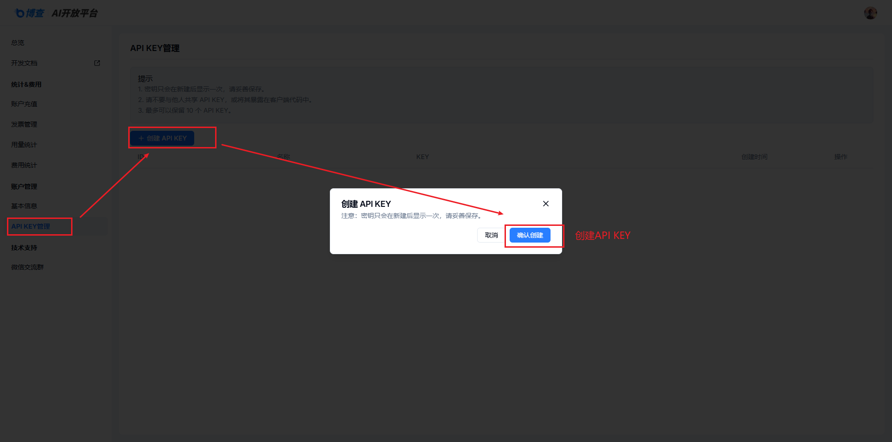
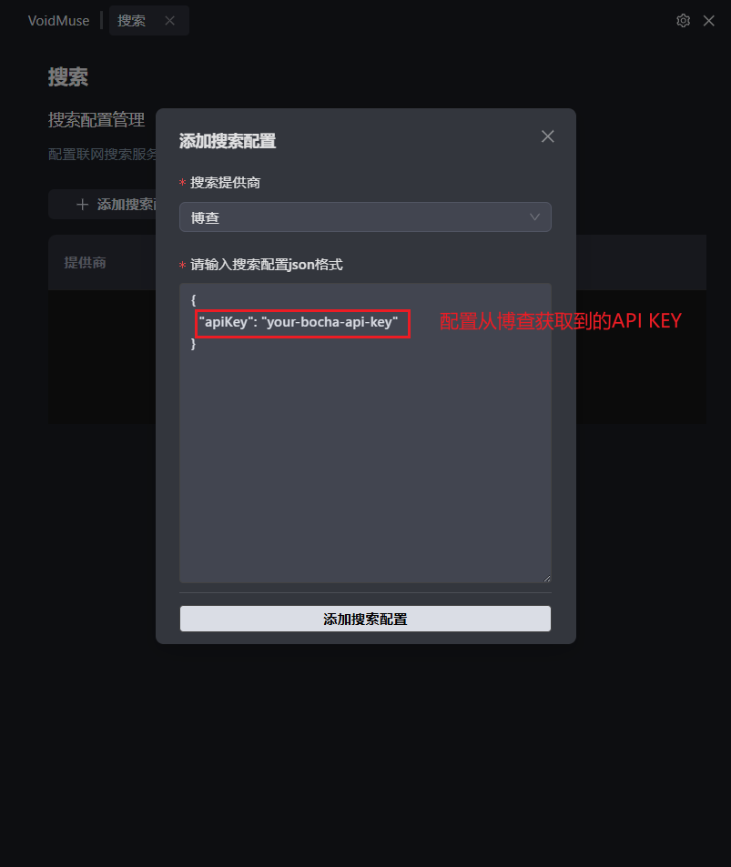

# 博查 AI 搜索配置指南

## 概述

博查（BochaAI）是一个专为 AI 应用设计的世界知识搜索引擎，能够为 AI Agents、AI Chatbots、AI Search 以及各类 RAG 应用提供干净、准确、高质量的搜索结果。作为 DeepSeek 联网搜索功能的官方合作伙伴，博查在 AI 搜索领域具有显著优势。
## 前置要求

在开始配置之前，请确保您已经：
- 注册博查 AI 开放平台账户
- 完成账户充值（博查采用预付费模式）

📋 **官方平台**：https://open.bochaai.com/

---

## 第一步：获取 API Key

### 1.1 访问 API Key 管理页面

🔗 **配置地址**：https://open.bochaai.com/api-keys

### 1.2 创建 API Key

按照以下步骤创建您的 API 密钥：

**步骤 1：** 进入 API Key 创建页面

**步骤 2：** 完成 API Key 创建并妥善保存

✅ 创建完成后，您将获得一个唯一的 API Key，请妥善保管此密钥。

---

## 第二步：账户充值

### 2.1 充值要求

⚠️ **重要提醒**：博查采用预付费模式，需要先充值才能使用 API 服务。

### 2.2 充值操作

🔗 **充值地址**：https://open.bochaai.com/recharge

按照页面提示完成账户充值，建议根据预期使用量合理充值。

---

## 第三步：在 VoidMuse 中配置参数

### 3.1 参数配置

将获取到的博查 API Key 配置到 VoidMuse 中：

### 3.2 配置项说明

| 配置项 | 说明 | 获取方式 |
|--------|------|----------|
| API Key | 博查 AI 搜索服务访问密钥 | 第一步获取 |

---

## 价格说明

### API 服务定价

📊 **当前定价**（详细信息请参考：https://bocha-ai.feishu.cn/wiki/JYSbwzdPIiFnz4kDYPXcHSDrnZb）：

| API 服务 | 价格 | 说明 |
|----------|------|------|
| Web Search API | ￥0.036/次调用 | 核心搜索服务 |
| Semantic Reranker API | 限时免费 | 语义重排序服务 |

### 成本优势

💡 **性价比分析**：
- 相比国际同类服务，价格优势明显
- 中文内容搜索效果优于 Bing，价格仅为其 1/3

## 注意事项

⚠️ **重要提醒**：
- 请妥善保管您的 API Key，避免泄露
- 博查采用预付费模式，请确保账户余额充足
- 建议根据实际使用需求合理规划调用次数
- 监控 API 使用量，避免意外产生过多费用

## 故障排除

如果在配置过程中遇到问题，请检查：
1. 博查账户是否已注册并完成实名认证
2. 账户余额是否充足
3. API Key 是否正确复制和配置
4. 网络连接是否正常
5. 是否遵守了 API 调用频率限制

## 技术支持

如需技术支持，请访问：
- **官方网站**：https://open.bochaai.com/
- **API 文档**：https://bocha-ai.feishu.cn/wiki/HmtOw1z6vik14Fkdu5uc9VaInBb

---

*最后更新时间：2025年7月*