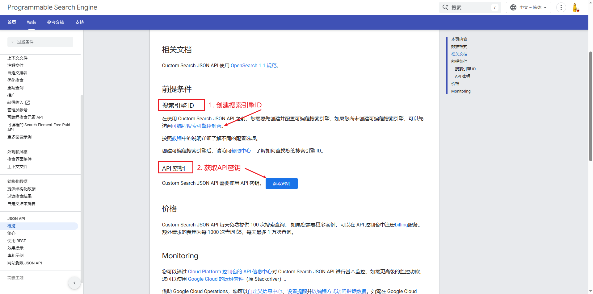
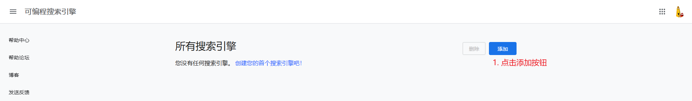
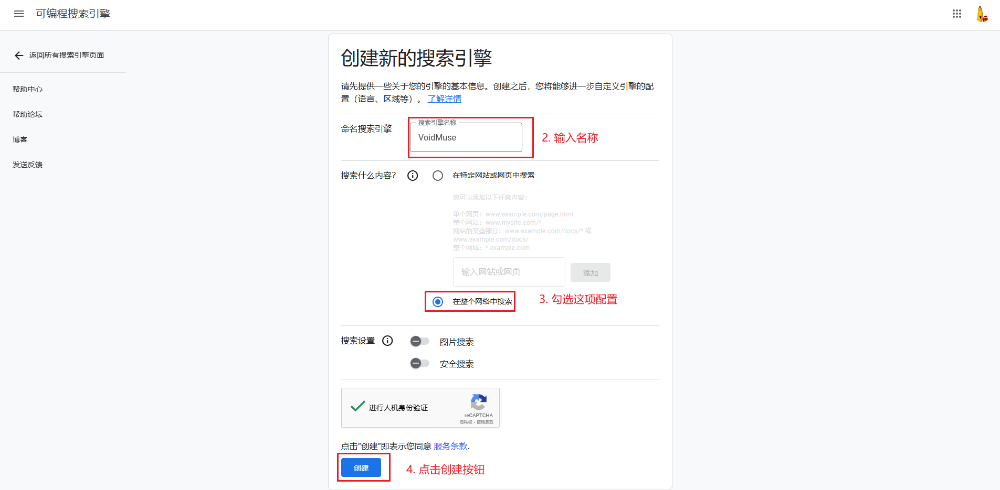
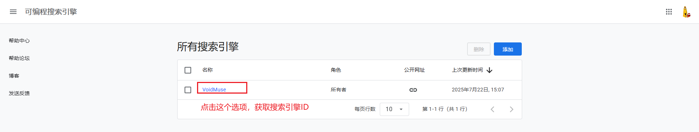
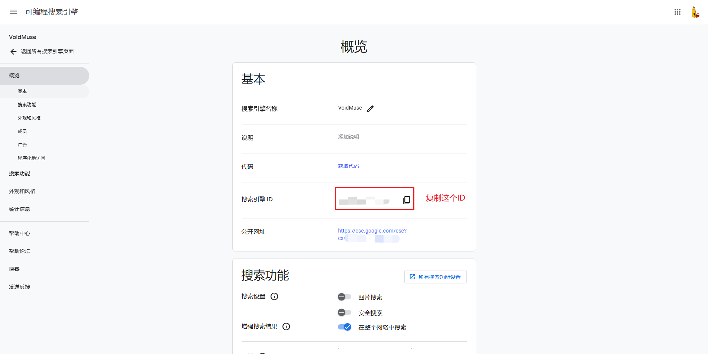
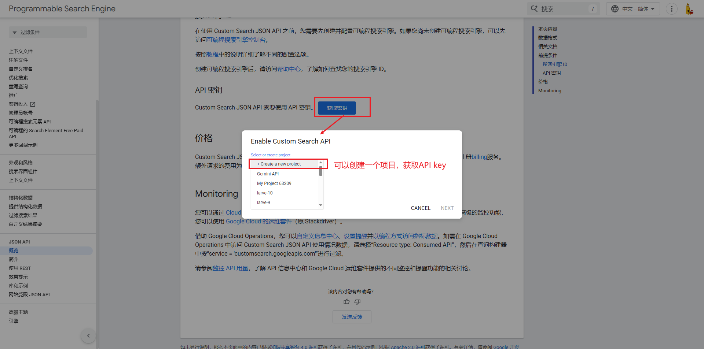
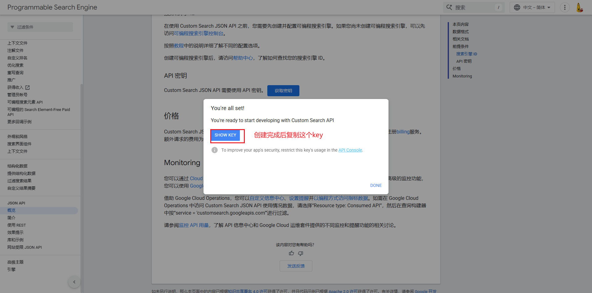
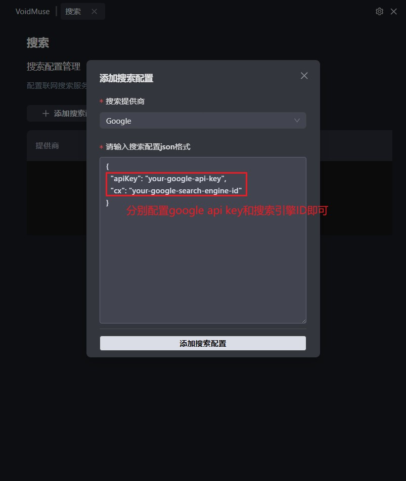

# Google 搜索配置指南

## 概述

使用 Google 自定义搜索服务需要配置两个关键参数：
- **Search Engine ID**（搜索引擎 ID）
- **API Key**（API 密钥）

## 前置要求

在开始配置之前，请确保您已经拥有 Google 账户，并访问以下官方配置页面：

📋 **官方文档**：https://developers.google.com/custom-search/v1/overview?hl=zh-cn

---

## 第一步：配置 Search Engine ID

### 1.1 访问配置页面

🔗 **配置地址**：https://programmablesearchengine.google.com/controlpanel/all?hl=zh-cn

### 1.2 创建自定义搜索引擎

按照以下步骤创建您的自定义搜索引擎：

**步骤 1：** 进入搜索引擎创建页面

**步骤 2：** 填写搜索引擎基本信息

**步骤 3：** 完成创建并获取 Search Engine ID

### 1.3 获取 Search Engine ID

✅ 配置完成后，您将获得一个唯一的自定义搜索引擎 ID，这个 ID 就是所需的 **Search Engine ID**。

---

## 第二步：配置 API Key

### 2.1 访问 API 配置页面

🔗 **配置地址**：https://developers.google.com/custom-search/v1/overview?hl=zh-cn

### 2.2 创建 API Key

按照以下步骤获取您的 API 密钥：

**步骤 1：** 进入 API 密钥管理页面

**步骤 2：** 创建并配置 API 密钥

---

## 第三步：在 VoidMuse 中配置参数

### 3.1 参数配置

将获取到的 Google 搜索参数配置到 VoidMuse 中：

### 3.2 配置项说明

| 配置项 | 说明 | 获取方式 |
|--------|------|----------|
| Search Engine ID | 自定义搜索引擎的唯一标识符 | 第一步获取 |
| API Key | Google API 访问密钥 | 第二步获取 |

---

## 价格说明

### 免费配额

🆓 **Custom Search JSON API** 提供以下免费服务：
- **每天免费查询次数**：100 次搜索查询
- **适用场景**：个人开发、小规模测试使用

### 付费方案

💰 如果您需要更多查询次数，可以通过以下方式升级：

| 配额类型 | 查询次数 | 价格 | 说明 |
|----------|----------|------|------|
| 免费配额 | 100次/天 | 免费 | 无需付费 |
| 付费配额 | 额外查询 | $5/1000次 | 需要在 API 控制台注册 billing 服务 |
| 最大限制 | 10,000次/天 | - | 每日查询上限 |

### 计费说明

📊 **重要信息**：
- 超出免费配额后，按 **每 1000 次查询 $5** 的标准收费
- 每天最多支持 **10,000 次查询**
- 需要在 Google Cloud API 控制台中启用 billing 服务
- 建议根据实际使用需求合理规划查询次数

---

## 注意事项

⚠️ **重要提醒**：
- 请妥善保管您的 API Key，避免泄露
- API Key 可能有使用配额限制，请根据需要选择合适的配额方案
- 确保搜索引擎的搜索范围设置符合您的使用需求
- 监控 API 使用量，避免意外产生费用

## 故障排除

如果在配置过程中遇到问题，请检查：
1. Google 账户是否已登录
2. API Key 是否已正确启用相关服务
3. Search Engine ID 是否正确复制
4. 网络连接是否正常

---

*最后更新时间：2025年7月*