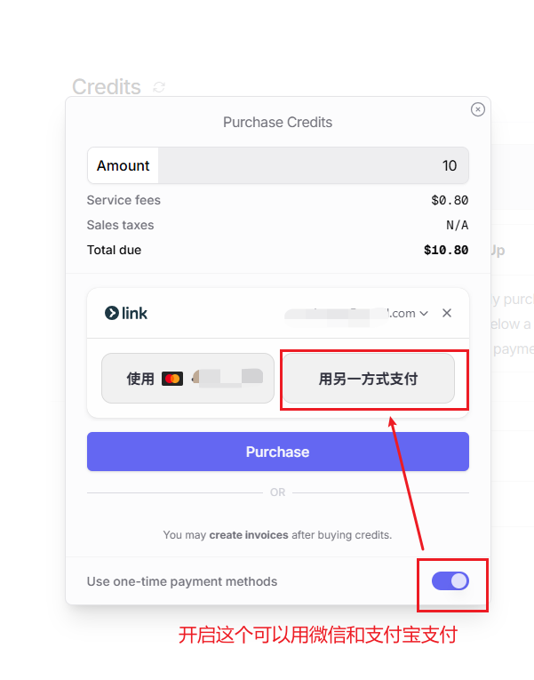
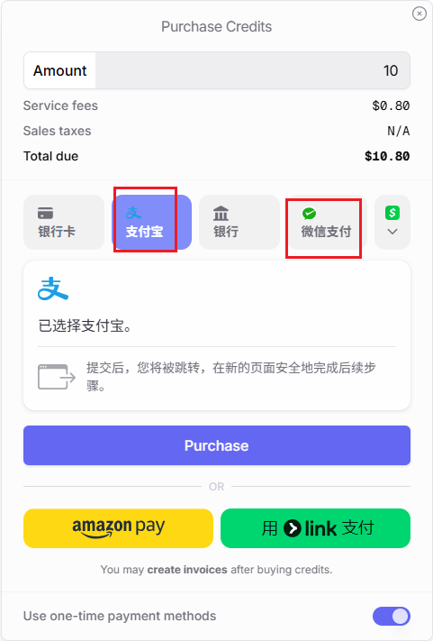
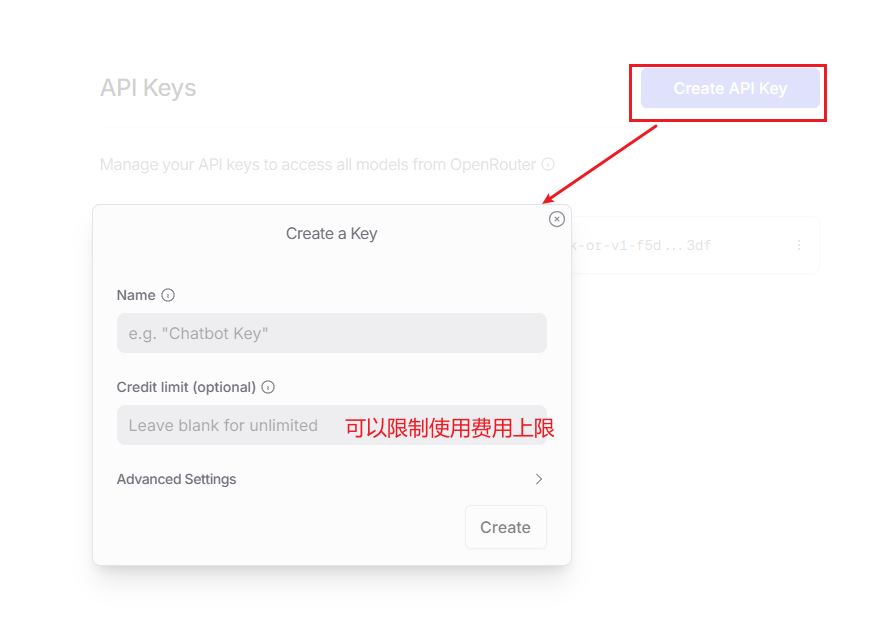
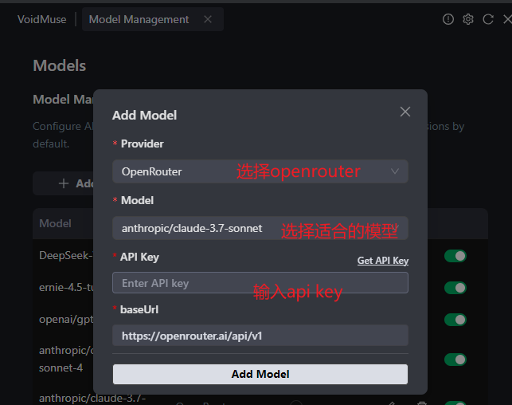

# 🌐 OpenRouter 配置指南

> 💡 **OpenRouter是什么？** 一个强大的AI模型聚合平台，提供多种顶级AI模型的统一API接口！

OpenRouter汇集了GPT-4、Claude、Gemini等众多优秀的AI模型，让你可以在一个平台上体验不同模型的特色。而且支持微信、支付宝等国内支付方式，非常方便！

---

## 🎯 为什么选择OpenRouter？

🌟 **模型丰富**：集成了市面上几乎所有主流AI模型  
💰 **价格透明**：按使用量计费，支持多种支付方式  
🔧 **接口统一**：一个API Key访问所有模型  
🚀 **响应快速**：全球CDN加速，访问速度快  
💳 **支付便捷**：支持微信、支付宝等国内支付方式  

---

## 💰 第一步：账户充值

### 注册并登录OpenRouter

1. 🔗 [访问OpenRouter官网](https://openrouter.ai/)
2. 注册账号并完成邮箱验证
3. 登录后进入控制台

### 充值账户余额

**第1步**：进入充值页面
- 🔗 [直达充值页面](https://openrouter.ai/settings/credits)
- 或在控制台点击"Credits"选项卡



**第2步**：选择充值金额
- 建议首次充值$5-10美元进行测试
- 根据使用需求选择合适的金额

**第3步**：选择支付方式
- 🎉 **好消息**：支持微信和支付宝支付！
- 国内用户可以直接使用熟悉的支付方式



> 💡 **充值小贴士**：OpenRouter的计费是按token使用量计算的，$5通常可以支持相当长时间的使用。建议先小额充值测试，确认效果后再根据需要追加。

---

## 🔑 第二步：创建API Key

### 生成API密钥

**第1步**：进入API Key管理页面
- 🔗 [直达API Key页面](https://openrouter.ai/settings/keys)
- 或在控制台点击"Keys"选项卡

**第2步**：创建新的API Key
- 点击"Create Key"按钮
- 为你的API Key设置一个容易识别的名称（如："VoidMuse-Dev"）



**第3步**：设置使用限制（推荐）
- **月度限额**：设置每月最大使用金额，避免意外超支
- **模型限制**：可以限制只使用特定的模型

> 🛡️ **安全提醒**：
> - API Key创建后只显示一次，请立即复制并妥善保存
> - 建议设置合理的使用限额，避免意外产生高额费用
> - 不要在公开代码中暴露API Key

---

## ⚙️ 第三步：在VoidMuse中配置

### 配置OpenRouter模型

**第1步**：打开VoidMuse设置
- 在IDE中打开VoidMuse插件设置
- 找到"模型配置"部分

**第2步**：添加OpenRouter配置
- **Provider**：选择"OpenRouter"
- **API Key**：粘贴刚才创建的API Key
- **Base URL**：`https://openrouter.ai/api/v1`（通常会自动填入）
- **Model ID**：选择你想使用的模型（如：`anthropic/claude-3.5-sonnet`）



**第3步**：测试连接
- 保存配置后，发送一条测试消息
- 确认AI能够正常响应

---

## 🎉 配置完成！开始体验

### 验证配置

**测试基本对话**：
```
你好，请介绍一下你自己
```

**测试代码能力**：
```
帮我写一个Python的快速排序算法
```

**测试分析能力**：
```
分析一下这段代码的时间复杂度
```

---

## 💡 使用技巧

### 成本控制

**1. 合理选择模型**
- 简单任务使用便宜的模型
- 复杂任务才使用高端模型

**2. 设置使用限额**
- 在API Key中设置月度限额
- 定期检查使用情况

**3. 优化提示词**
- 清晰简洁的提示词能减少token消耗
- 避免重复或冗余的对话

### 模型切换

**快速切换**：
- 可以创建多个配置，对应不同的模型
- 根据任务类型快速切换使用的模型

**A/B测试**：
- 同一个问题可以尝试不同模型的回答
- 找到最适合你使用习惯的模型

---

## 🆘 常见问题

### 充值相关

**Q: 支持哪些支付方式？**  
A: 支持信用卡、PayPal、微信、支付宝等多种支付方式

**Q: 充值有最低金额限制吗？**  
A: 通常最低充值$5，具体以页面显示为准

**Q: 余额用完了怎么办？**  
A: 可以随时充值，充值后立即可用

### API使用相关

**Q: API Key有使用期限吗？**  
A: 没有固定期限，但建议定期更换以确保安全

**Q: 可以同时使用多个模型吗？**  
A: 可以，一个API Key可以访问所有可用模型

**Q: 如何查看使用量？**  
A: 在OpenRouter控制台的"Usage"页面可以查看详细使用统计

### 配置相关

**Q: VoidMuse连接不上OpenRouter？**  
A: 检查API Key是否正确，网络是否正常，Base URL是否正确填写

**Q: 模型响应很慢？**  
A: 可能是网络问题或模型负载较高，可以尝试切换其他模型

---

## 🔗 相关链接

- 🌐 [OpenRouter官网](https://openrouter.ai/)
- 💰 [充值页面](https://openrouter.ai/settings/credits)
- 🔑 [API Key管理](https://openrouter.ai/settings/keys)

---

> 🎯 **小贴士**：OpenRouter是一个非常灵活的平台，支持几乎所有主流AI模型。合理配置和使用，可以大大提升你的AI编程体验！