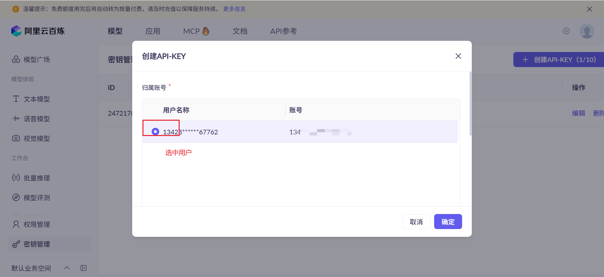
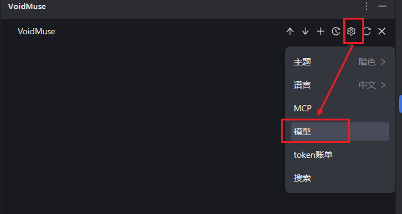
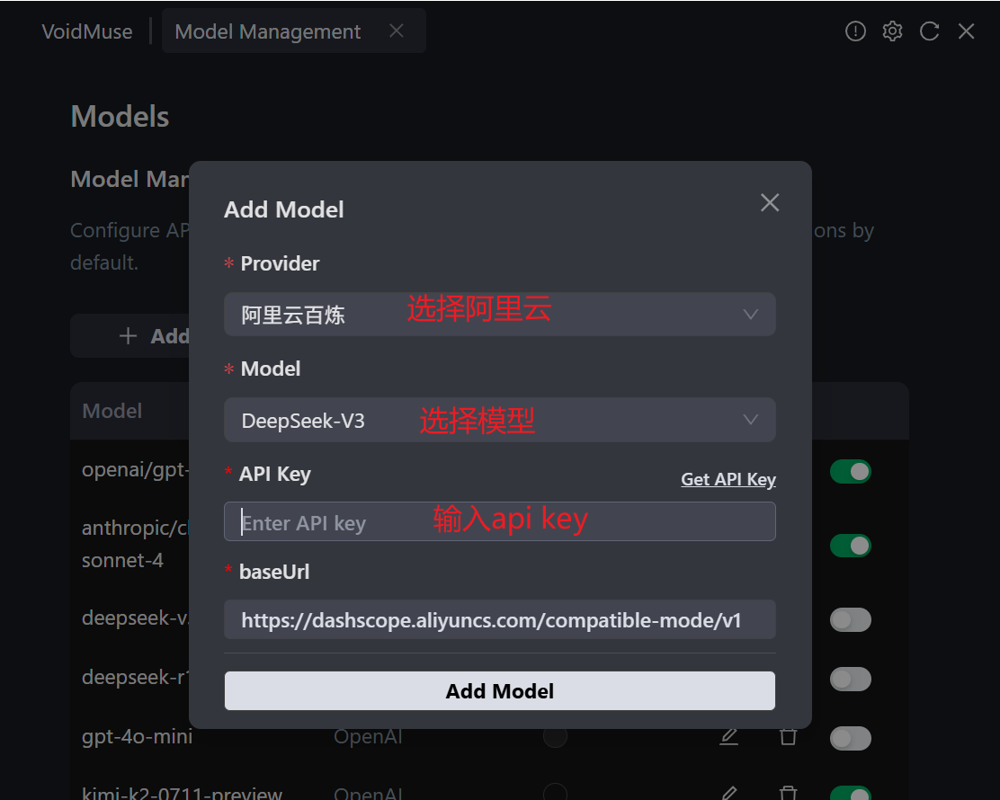
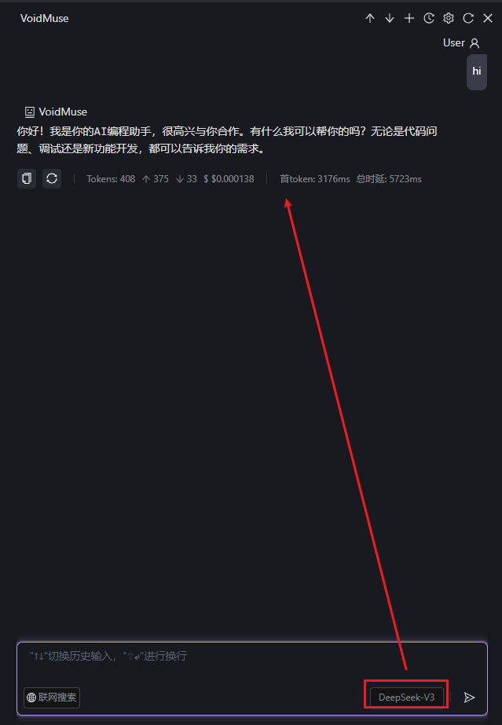
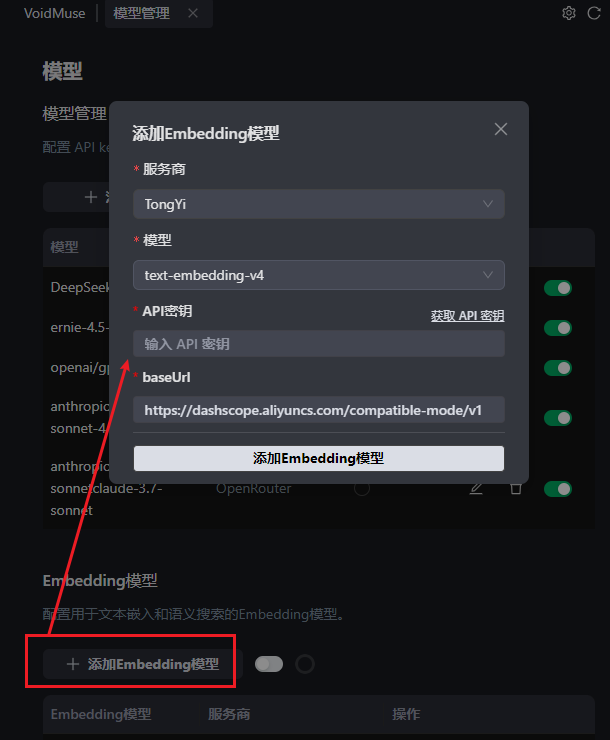
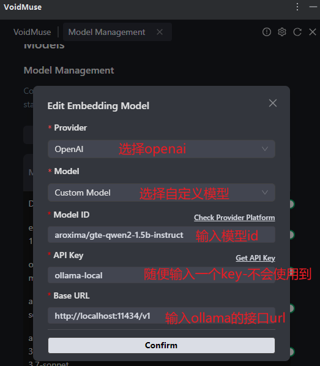
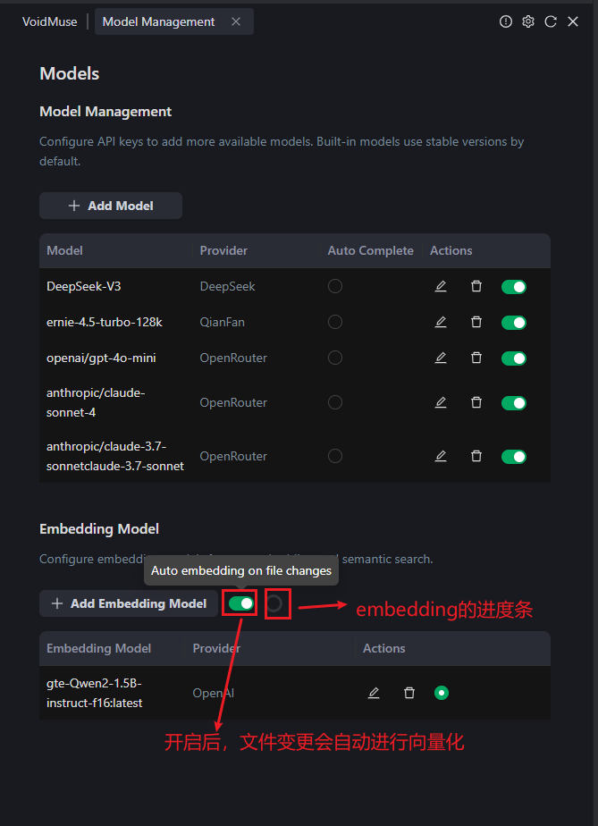

# 🚀 三步快速上手 VoidMuse

> 💡 **只需3分钟，让你的IDE变身AI助手！**

嘿！想要快速体验VoidMuse的强大功能吗？跟着这个超简单的配置指南，三步搞定，马上开始你的AI编程之旅！

---

## 📋 配置清单

在开始之前，我们需要配置这三个核心功能：

- ✅ **第一步**：配置AI模型（必须）- 让AI能够理解和回答你的问题
- ✅ **第二步**：配置搜索功能（推荐）- 让AI能够搜索最新信息
- ✅ **第三步**：配置代码理解（推荐）- 让AI能够深度理解你的代码库

> 🎯 **小贴士**：第一步是必须的，后面两步可以根据需要选择配置哦！

---

## 🎯 第一步：配置AI模型 - 让AI开口说话

### 为什么选择阿里云百炼？

🎁 **免费福利**：每个模型都有100万token的免费额度，够你用很久了！  
🚀 **模型丰富**：支持最新的DeepSeek-R1、DeepSeek-V3等热门模型  
⚡ **速度快**：国内访问速度杠杠的，告别网络卡顿  

### 🌐 其他选择：OpenRouter

如果你想体验更多AI模型（如GPT-4、Claude、Gemini等），可以选择OpenRouter：

🌟 **模型丰富**：集成了市面上几乎所有主流AI模型  
💳 **支付便捷**：支持微信、支付宝等国内支付方式  
🔧 **接口统一**：一个API Key访问所有模型  

> 📖 **详细配置**：查看[OpenRouter详细配置指南](./openrouterConfig.md)了解完整的充值和配置流程  

### 快速获取API Key

**第1步**：注册阿里云账号
- 🔗 [点击注册阿里云](https://bailian.console.aliyun.com/#/home)
- 完成实名认证（很快的，几分钟搞定）

**第2步**：获取API Key
- 🔗 [直达API Key管理页面](https://bailian.console.aliyun.com/?tab=model#/api-key)
- 点击"创建API Key"，复制保存好




**第3步**：在VoidMuse中配置
- 打开插件设置-模型配置
- 粘贴你的API Key




> 💰 **省钱小技巧**：想要更多免费额度？查看我们的[免费额度大全](./freeLLMQuota.md)，发现更多薅羊毛机会！

### 🎉 恭喜！第一步完成，现在就能开始聊天了

配置完API Key后，你就可以立即开始使用VoidMuse的核心功能了！试试问AI一些编程问题吧：



*↑ 配置完成后就能立即开始AI对话*

**💡 试试这些问题**：
- "你好，请介绍一下你自己"
- "帮我解释一下React的useState钩子"
- "如何优化JavaScript的性能？"

> 🚀 **小贴士**：虽然后面两步是推荐配置，但仅凭第一步的AI模型配置，你就已经可以享受强大的AI编程助手功能了！搜索和代码理解功能会让体验更上一层楼。

---

## 🔍 第二步：配置搜索功能 - 让AI获取最新信息

### 为什么需要搜索功能？

🌐 **实时信息**：AI能够搜索最新的技术文档、解决方案  
📚 **知识补充**：当AI的训练数据不够新时，搜索来补充  
🎯 **精准答案**：结合搜索结果给出更准确的回答  

### 两种搜索方式任你选

#### 🥇 推荐：Google搜索（质量最高）

**优势**：搜索质量高，结果准确, 免费
**劣势**：配置稍复杂  

**快速配置**：
1. 🔗 [创建Google自定义搜索](https://programmablesearchengine.google.com/controlpanel/all?hl=zh-cn)
2. 🔗 [获取API Key](https://developers.google.com/custom-search/v1/overview?hl=zh-cn)
3. 在VoidMuse中填入Search Engine ID和API Key

> 📖 **详细教程**：配置有点复杂？查看[Google搜索详细配置指南](./googleSearchConfig.md)


#### 🥈 备选：博查搜索（国内友好）

**优势**：国内访问无障碍，配置简单  
**劣势**：需要付费使用 

**快速配置**：
1. 🔗 [注册博查账号](https://www.bocha.ai/)
2. 获取API Key
3. 在VoidMuse中配置

> 📖 **详细教程**：查看[博查搜索详细配置指南](./bochaSearchConfig.md)


---

## 🧠 第三步：配置代码理解 - 让AI读懂你的项目

### 什么是Embedding模型？

🤖 **简单理解**：就是让AI能够"理解"你的代码，建立代码的"记忆"  
🔍 **核心功能**：支持Codebase代码库搜索 

### 继续用阿里云（最简单）

好消息！如果你已经配置了第一步的阿里云API，那这一步几乎不用额外配置！

**阿里云Embedding模型**：
- `text-embedding-v4`（推荐，最新版本）
- `text-embedding-v3`（稳定版本）

**配置方法**：
1. 使用相同的API Key
2. 在VoidMuse的Embedding设置中选择对应模型
3. 完成！就是这么简单！



### 🏠 本地部署：Ollama（隐私优先）

**优势**：完全本地运行，数据隐私有保障，无需网络连接  
**劣势**：需要一定的硬件配置，首次配置稍复杂  

**快速配置**：

**第1步**：安装Ollama
- 🔗 [下载Ollama](https://ollama.com/download)
- 安装完成后，在终端运行验证：`ollama --version`

**第2步**：下载推荐的Embedding模型
```bash
ollama pull aroxima/gte-qwen2-1.5b-instruct
```

**第3步**：在VoidMuse中配置
- 选择"自定义模型"
- Provider选择"OpenAI"
- API Key随便填写（如：`ollama-local`）
- Base URL填写：`http://localhost:11434/v1`
- Model ID填写：`aroxima/gte-qwen2-1.5b-instruct`


> 💡 **小贴士**：Ollama使用OpenAI兼容的API协议，所以可以直接使用OpenAI的配置方式！

> 🎯 **使用技巧**：配置完成后，试试问AI"这个项目的架构是怎样的？"，看看效果！

---

### 开启embedding
可以通过开启自动开启embedding，文件变更时就会自动进行embedding了



## 🎉 配置完成！开始体验

### 验证配置是否成功

**测试AI对话**：
```
你好，请介绍一下你自己
```

**测试搜索功能**：
```
搜索一下最新的React 19有什么新特性
```

**测试代码理解**：
```
分析一下这个项目的主要功能模块
```

---

## 🆘 遇到问题？

### 常见问题快速解决

**Q: 搜索功能用不了？**  
A: 确认网络连接可用

**Q: 代码理解功能没反应？**  
A: 第一次使用需要建立索引，大项目可能需要几分钟时间

### 🔗 获取帮助

- 📖 [查看详细文档](../README.md)
- 🐛 [提交问题](https://github.com/your-org/voidmuse/issues)
- 💬 [加入交流群](../README.md#-联系我们)

---

## 🎯 下一步

恭喜！你已经成功配置了VoidMuse。现在可以：

1. 🏗️ [了解技术架构](./architecture.md) - 深入了解VoidMuse的设计理念
2. 🤝 [参与贡献](./contributing.md) - 一起让VoidMuse变得更好
3. 💰 [探索更多免费资源](./freeLLMQuota.md) - 发现更多AI服务的免费额度

---

<div align="center">

**🎉 开始你的AI编程之旅吧！**

*有问题随时在群里问，大家都很友好的～*

</div>