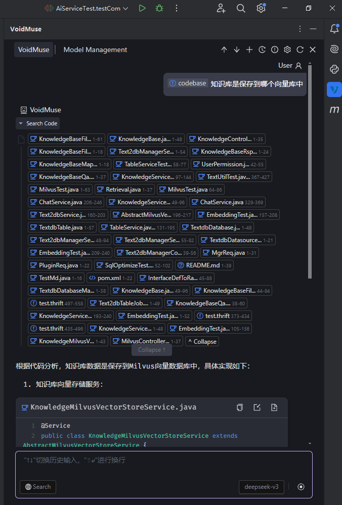
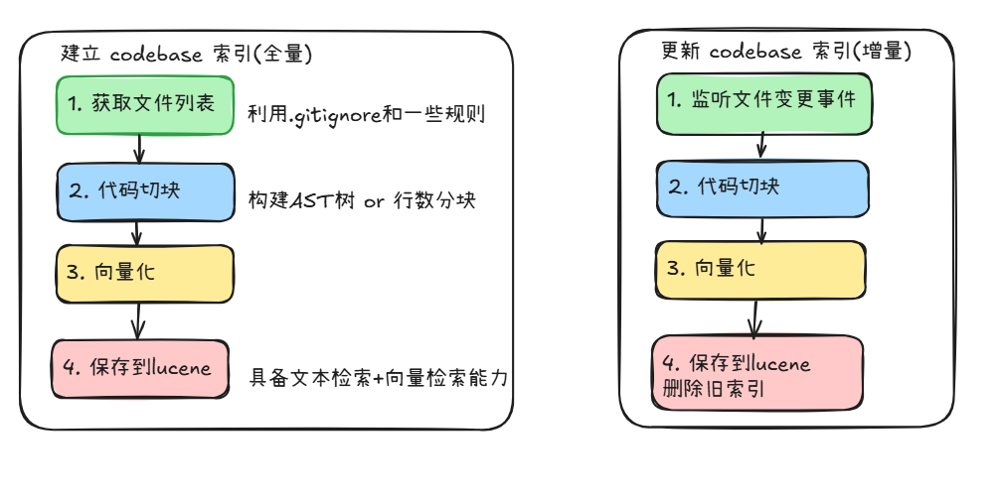
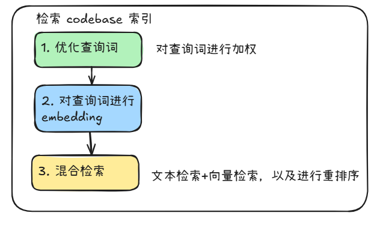

## 1. 前言
为什么要做这个开源项目？

这两年AI发展非常快，有很多的新概念出现比如 embedding 、RAG、function call等，但这些技术有什么作用，在一个实际的项目中能带来什么样的价值，如何在项目中实践这些技术，这些都是我们很好奇的点，也就萌生了一个想法，构建一个项目，在项目中实践这些技术，在干中学是学习效率最高的，不然对这些知识只是浮于表层，于是我们就构建了一个 VoidMuse 项目，实现一个ai ide coding插件，把我们所想要学习的知识点都实践上

而为什么不直接在 cline 这种开源插件上进行扩展开发，而是从零实现呢， cline 的代码太复杂了，想要从中实践成本很高，直接从零开始做一个简单的项目来实现满足目标就足够了

而这一篇文章是介绍 codebase 的真正实现，我们完整实现了在 chat 页面中调用 codebase 进行代码检索然后加入到 llm 上下文中，这里面也包含了很多优化细节，比如embedding模型的选择坑点，还有单纯向量检索是有局限性的，我们利用了混合检索来提高检索的准确性，这些都是在实践中发现的点，看完本篇文章你会codebase实际的实现有一个更深入的了解

## 2. 完整实现流程

实现codebase功能的关键是有两部分的
1. 建立codebase索引：对全量代码文件进行向量化，这里涉及到代码分块、向量化、文件选择策略等
2. 检索codebase索引：根据查询进行向量化检索+文本检索，这里采用了混合检索来提高准确率，并且通过提示词加权来提高检索词的权重

以下详细介绍这两部分实现细节

## 3. 建立codebase 索引

### 3.1 移除文件
一个代码仓库中，有众多文件，包含系统本身的隐藏文件、依赖库（比如node_modules），还有一些协议生成的大文件，比如java项目中使用pb协议生成的java文件非常庞大，这些文件对代码检索没有帮助，所以需要提前去除掉这些文件

筛选策略如下
1. `.gitignore`: 代码仓库中通常会有一个 `.gitignore` 文件，里面列出了需要忽略的文件和目录，我们根据这个文件来移除掉忽略的文件，一般大部分依赖文件都会在这个阶段就被排除掉了
2. 额外排除“pb 自动生成的文件”: 在java项目中使用pb协议生成的java文件非常庞大，这些文件对代码检索没有帮助，我们的项目中用到挺多pb协议所以专门做了一个移除处理
3. 空文件和大文件排除掉：我们同时对超过 `1MB` 的文件进行排除

具体代码可参考 ： [CheckAutoIndexingTask.startCheckAll 方法](../../../extensions/intellij/src/main/java/com/voidmuse/idea/plugin/codebase/CheckAutoIndexingTask.java)

### 3.2 代码分块
一个文件通常包含多个函数，并且文件行数都是不确定的，有可能一个代码文件几千行代码都是有可能的，而embedding 模型是有上下文长度限制的，所以要对代码文件进行分块，每一个分块单独进行向量化

代码文件分块有两种策略（我们参考了 `continue` 插件的方案）
1. 根据代码的结构（如函数、类等）将文件内容分割成多个块生成抽象语法树（AST）：就是把代码转成一种更加结构化的数据，能提供更多文本特征，并且是完整的函数表示
2. 使用字符数或者行数进行分块: `continue`插件的兜底方法

在`VoidMuse`中我们只实现了最简单的按行数进行分块，对文件按随机行数分块（35-65行），当然这种缺点很明显，有可能一个完整函数会被切割成几块

备注：embedding 模型的踩坑点，一开始我们挑选embedding模型时希望能支持中文，那时选择了开源的 `bge-large-zh-v1.5` 模型，但这个模型的上下文长度限制是512个token，代码文件分块后挺容易就超过这个限制，就会导致向量化的结果不准确，后续我们是换成了 `Qwen3-Embedding-0.6B` 模型, 本地就能运行起来了，这个模型的上下文长度限制是32,000个token，一般也满足要求了，在一些做知识库的场景也能满足了，并且向量维度是 1536 ，这就表示一个信息能用到更多维度来表示，向量化更加准确

### 3.3 调用embedding接口向量化和保存到 lucene
每一个代码块单独调用embedding接口向量化，然后把向量化结果保存到 lucene 索引中，lucene 索引中包含了代码块的文本内容、向量化结果、文件路径、行号等信息

而这里我们使用 lucene 来存储索引，lucene 是一个基于 java 实现的全文检索引擎，支持中文检索，并且性能非常好，我们在项目中使用 lucene 来存储索引，检索时直接调用 lucene 的 api 即可, 并且我们也想利用到 lucene 提供的文本检索 + 向量检索的功能，来提高检索的准确性

具体代码可参考：[`LuceneVectorStore.java`](../../../extensions/intellij/src/main/java/com/voidmuse/idea/plugin/codebase/vector/LuceneVectorStore.java)

## 4. 检索codebase 索引

### 4.1 优化查询词
我们在测试中发现，直接对查询词进行向量化检索，效果不是特别好，所以我们在查询词向量化前，先对查询词进行了一些优化，转化成更符合进行向量检索的查询词，包括对一些关键词语进行重复3词来提升权重（这一点在平时写长prompt时，想要提升某一段规则的重要性，也可以把这段规则重复几次之后，权重也就提高了）

比如用户查询词是 `找出关于订单号 OrderID 生成相关的信息`，我们会把查询词优化成 `OrderID OrderID OrderID 订单号生成 订单号生成规则 订单号生成逻辑 订单号生成文档`，重复3次，来提升订单号这个关键词的权重

具体优化提示词是在: [`codebaseOptimizePrompt.txt`](../../../gui/src/config/prompts/codebaseOptimizePrompt.txt)
优化流程是在 GUI 中: [`IDEService.ts`](../../../gui/src/api/IDEService.ts) 的 `buildWithCodebaseContext`    

### 4.2 对查询词进行embedding
这部分就是对查询内容进行向量化，这里就不再对向量化部分重复介绍

### 4.3 混合检索(最关键的地方)
一开始我们采用的方案是向量检索，但这种方案是存在局限性的

1.Embedding的语义理解局限性
- 语义泛化：Embedding模型（如BERT、GPT等）通常通过捕捉文本的语义信息来进行检索。然而，代码的语义与自然语言不同，代码的精确性要求更高。Embedding模型可能会将类名、方法名等符号的语义泛化，导致检索时无法精确匹配。
- 符号信息丢失：Embedding模型在处理代码时，可能会忽略类名、方法名等符号的精确信息，尤其是在符号本身具有特定含义或命名规则时。这会导致即使提问中指定了类名，模型也无法准确捕捉到这些符号信息。

2.Embedding的上下文依赖
- 上下文理解偏差：Embedding模型在处理代码时，通常依赖于上下文信息来生成向量表示。如果提问中包含了过多的细节（如类名、方法名等），模型可能会过度依赖这些细节的上下文，而忽略了代码的整体结构或功能，导致检索结果偏离预期。
- 过拟合问题：当提问过于详细时，Embedding模型可能会“过拟合”到提问中的某些细节，而忽略了代码库中更广泛的相关性。这会导致检索结果过于狭窄，甚至无法找到相关代码片段。

3.代码的结构化特性
- 符号检索的重要性：代码库中的类名、方法名等符号具有特定的结构和命名规则，这些符号在代码检索中扮演着重要角色。单纯依赖Embedding的向量检索无法充分利用这些符号的结构化信息，导致检索效果不佳。
- 混合检索的必要性：为了提高代码检索的准确性，通常需要结合符号检索和Embedding的向量检索。符号检索可以精确匹配类名、方法名等符号，而Embedding检索可以捕捉代码的语义信息。两者结合可以更好地平衡检索的精确性和语义理解。

总结：代码检索要使用混合检索技术:  符号检索 + 向量检索

而刚好 lucene 提供了文本检索 + 向量检索的功能，我们是直接利用这个来进行实现

具体代码：[`LuceneVectorStore.hybridSearch`](../../../extensions/intellij/src/main/java/com/voidmuse/idea/plugin/codebase/vector/LuceneVectorStore.java)
这里主要特点是
- 检索文本(根据语义相似度进行搜索 ) + 检索向量，比如输入一个`twoStageHybridSearch的具体实现是什么的`，会去检索`twoStageHybridSearch`这个文字的相关数据块，以及整个句子向量化后的数据块，对这两部分数据进行一个混合分数计算，提高整体搜索效果
- 检索时都要扩大候选集：取多一点数据出来，能提升召回，比如预期是获取10条数据，那么扩大候选集获取30条数据，再进行一个排序
- 排序处理：检索出来的数据进行混合分数计算，获取top k的数据

## 5. 扩展阅读：为什么cline不使用向量检索呢
cline插件介绍：cline也是一款开源的插件，但跟cursor有一点挺大的不同，就是cline是不会进行codebase检索的，也就是不会利用向量进行检索

cline是利用了另一种方案： 通过理解代码中的依赖项，比如import这种来不断地读取相关的文件，类似人在理解代码时，是会不断自己跳转到依赖的代码文件进行阅读理解的，这种缺点就是依赖多的话就得不断地进行阅读，上下文会被占挺多的，并且如何判断停止加载新文件了，一个大型仓库里面一直读取依赖项是有可能非常多的（利用的是AST 解析方案，我们之前在做autocompelete时，其实也用到了这种策略，因为要结合一些依赖作为上下文才能更好地预测下一句内容）

那么这点就挺有意思的，cursor是对整个项目进行向量检索，是从技术角度去提取相关性信息，而cline则是从代码的依赖项角度去提取相关性信息，更像是一个人阅读代码的步骤

## 6. 总结
codebas的实现简单说就是rag，对内容进行向量化，使用时使用向量检索，但要做得好的话就要对各种细节进行优化，比如代码分块的策略、搜索词的加权、文本检索的加入等，通过这一次实践，已经能基本了解到 cursor 这类型的ai coding工具的codebase具体实现原理，虽然他们的工程化肯定是更加复杂的，但大概的流程思路是有认识了

后续希望在记忆能力上也能进行一些实践，现在大模型的上下文是有限的，并且新开一次对话，之前累计对话的一些信息要点都丢失了，而记忆能力就能实现对之前对话的一些信息进行保留，并且在后续的对话中能够利用这些信息进行更准确的回答

## 7. 相关资料
- [cline不检索代码块库的原因](https://zhuanlan.zhihu.com/p/1919489523823407360)
- [官方介绍不用codebase index的原因](https://cline.bot/blog/why-cline-doesnt-index-your-codebase-and-why-thats-a-good-thing)
- [这里有讨论cursor的codebase和cline检索代码机制的优缺点](https://news.ycombinator.com/item?id=44106944)
- [混合检索](https://www.pinecone.io/blog/hybrid-search/)